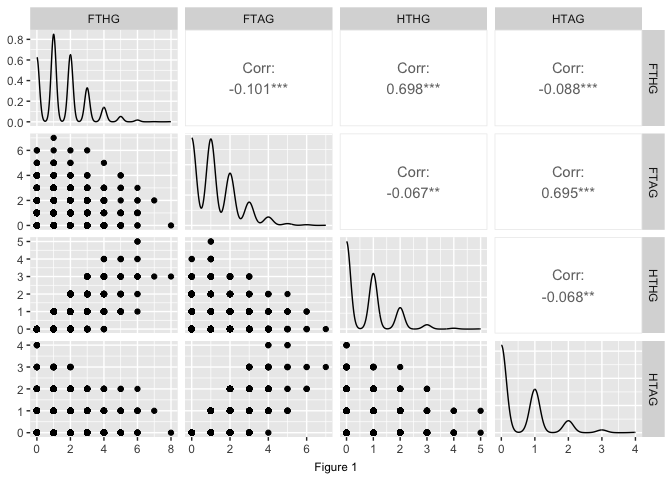

The Referee Report: A Data Science Analysis of Premier League Referees
================
Written by Alex Marzban, Alicja Mahr, Arya Antara, Lance Yoon, Mark Kim,
Ryan Lee

# Abstract

Football referees play a crucial role in ensuring all rules are followed
and fair play is practiced. Unfortunately, they can also use their
powers to influence outcomes of games. There have always been shady
stories in which referees favor certain sides, and with the 2022 World
Cup in Qatar having some of the most controverisal calls in the sport’s
history, our team wanted to explore the extent of these biases. We
investigated the English Premier League’s referees and their decisions,
including fouls, penalties, red cards, and yellow cards and the
consequential outcomes, such as half-time and full-time goals scored.
More specifically, our analysis of nearly every game played from
2014-2015 to 2018-2019 sought to answer three questions. (1). Is there a
difference between the number of fouls, yellow cards, and red cards
booked against the Big 6 relative to other teams? (2). Which referees
display bias towards certain teams? (3). Which teams are most likely to
have fouls, yellow cards, and red cards booked against them? Our
findings saw that certain referees may have negative biases, and certain
teams have more/less calls than others on average, but it is difficult
to definitively conclude any biases, as many other variables besides
referee calls can also sway the outcome of games. Keywords: Bias,
outcome, yellow card, red card, fouls, penalties, goals, referees

# Introduction

Refereeing decisions have always been an important part of football
since they are responsible for enforcing the rules and ensuring fair
play. However, there are instances where the decisions made by referees
can impact the outcome of the game. Over the years, there has been a lot
of debate about the impact that referees can have on the outcome of a
match. Especially with the recent World Cup, this debate has been
heightened, with some high-profile incidents leading to controversy and
calls for changes to the way that referees are selected, trained, and
evaluated.

One way in which referees can affect the outcome of a football game is
through their interpretation of the rules. Referees have a certain
amount of discretion when it comes to enforcing the laws of the game,
and their interpretations can sometimes be subjective. For example, a
referee may choose to overlook a minor foul committed by a player, while
another referee may consider it to be a more serious offense and award a
free kick or even a penalty kick. These decisions can have a significant
impact on the game since a free kick or penalty kick can change the
momentum and ultimately the outcome of the match.

Another way in which referees can affect the outcome of the game is
through their mistakes. Referees are human, and they can make mistakes
in judgment or miss critical incidents during the game. However, these
mistakes can also have a significant impact on the match’s outcome. In
some cases, a referee’s mistake can result in a goal being awarded to
the wrong team or a crucial penalty being overlooked, which can lead to
an unfair advantage for one team over the other.

There are a lot of ways in which referees can have a significant impact
on the outcome of the game. Therefore, our group wanted to focus on the
2014-2019 seasons of the English Premier League and analyze the impact
the referees had for those two seasons. In order to do this, we
collected and integrated five datasets containing various information
about the matches, including the match results, player statistics, and
referee performance.We then compared the frequency of each referee
giving out yellow and red cards, fouls, free kicks, etc. to determine
how the referees have an impact on the outcome of premier league
matches. Our main objective for this project was to determine referee
biases and the amount of impact they put on the outcome of games.

## Questions

1.  Is there a difference between the number of fouls, yellow cards, and
    red cards booked against the Big 6 relative to other teams?
2.  Which referees display bias towards certain teams?
3.  Which teams are most likely to have fouls, yellow cards, and red
    cards booked against them?

# Exploration

# Results

## Question 1: Is there a difference between the number of fouls, yellow cards, and red cards booked against the Big 6 relative to other teams?

<table class="gt_table" data-quarto-disable-processing="false" data-quarto-bootstrap="false">
  <thead>
    <tr class="gt_heading">
      <td colspan="6" class="gt_heading gt_title gt_font_normal" style>Summary Statistics</td>
    </tr>
    <tr class="gt_heading">
      <td colspan="6" class="gt_heading gt_subtitle gt_font_normal gt_bottom_border" style>Figure 9</td>
    </tr>
    <tr class="gt_col_headings">
      <th class="gt_col_heading gt_columns_bottom_border gt_left" rowspan="1" colspan="1" scope="col" id="metric">metric</th>
      <th class="gt_col_heading gt_columns_bottom_border gt_left" rowspan="1" colspan="1" scope="col" id="big_6_mean">big_6_mean</th>
      <th class="gt_col_heading gt_columns_bottom_border gt_left" rowspan="1" colspan="1" scope="col" id="bad_6_mean">bad_6_mean</th>
      <th class="gt_col_heading gt_columns_bottom_border gt_left" rowspan="1" colspan="1" scope="col" id="p_value">p_value</th>
      <th class="gt_col_heading gt_columns_bottom_border gt_left" rowspan="1" colspan="1" scope="col" id="lower_CI">lower_CI</th>
      <th class="gt_col_heading gt_columns_bottom_border gt_left" rowspan="1" colspan="1" scope="col" id="upper_CI">upper_CI</th>
    </tr>
  </thead>
  <tbody class="gt_table_body">
    <tr><td headers="metric" class="gt_row gt_left">Fouls</td>
<td headers="big_6_mean" class="gt_row gt_left">10.46587047</td>
<td headers="bad_6_mean" class="gt_row gt_left">11.095401</td>
<td headers="p_value" class="gt_row gt_left">0.20006498</td>
<td headers="lower_CI" class="gt_row gt_left">-1.45686692</td>
<td headers="upper_CI" class="gt_row gt_left">0.19780511</td></tr>
    <tr><td headers="metric" class="gt_row gt_left">Yellow Cards</td>
<td headers="big_6_mean" class="gt_row gt_left">1.60968531</td>
<td headers="bad_6_mean" class="gt_row gt_left">1.811880</td>
<td headers="p_value" class="gt_row gt_left">0.02687396</td>
<td headers="lower_CI" class="gt_row gt_left">-0.27242113</td>
<td headers="upper_CI" class="gt_row gt_left">-0.13196914</td></tr>
    <tr><td headers="metric" class="gt_row gt_left">Red Cards</td>
<td headers="big_6_mean" class="gt_row gt_left">0.05834267</td>
<td headers="bad_6_mean" class="gt_row gt_left">0.053349</td>
<td headers="p_value" class="gt_row gt_left">0.71161580</td>
<td headers="lower_CI" class="gt_row gt_left">-0.01991453</td>
<td headers="upper_CI" class="gt_row gt_left">0.02990187</td></tr>
  </tbody>
  &#10;  
</table>

## Question 2: Which referees display bias towards certain teams?

## Question 3: Which teams are most likely to have fouls, yellow cards, and red cards booked against them?

# Discussion

## Exploration

In our analysis of the English Premier League (EPL), we focused on two
separate areas: the relationship between half-time and full-time goal
counts and the number of yellow cards issued by each referee to the home
and away teams. Initially, we created a catalog of qualified referees
who had officiated in at least 20 games over the five seasons we
considered. We then filtered the ‘epl_data’ data frame, retaining only
the games officiated by these qualified referees, and performed
exploratory analysis on the relationship among the half-time and
full-time goal counts for both home and away teams.

Our analysis showed that, apart from the correlation between half-time
home goals (HTHG) vs full-time home goals (FTHG) and half-time away
goals (HTAG) vs full-time away goals (FTAG), there was no significant
correlation among other variables. The correlation coefficient for the
former comparison was 0.7, and the scatter plot demonstrated that when a
team scored more goals in the first half, they were more likely to
maintain their lead and win the game.

Moving on to the second area of focus, we computed the number of yellow
cards given to both teams by each referee and created a heat map to show
the ratio of cards given to the home team vs the total number of cards
in a game by each referee. We split the data into two groups -
‘home_cards’ and ‘away_cards’ - and created a single data frame,
‘all_cards,’ that included the total number of cards given to each team
by each referee. We created a new variable to represent the total number
of cards given to each team by all referees and calculated the
percentage of cards given to the home team by each referee. The heat map
created for Manchester United revealed a significant difference between
the referees.

Our analysis suggests that referees’ decisions can impact the outcome of
games, with a team that is consistently given more yellow cards than
their opponents facing a potential disadvantage. However, note that our
analysis only considered yellow cards and did not include other factors
that could affect the game’s outcome, such as red cards, penalties, or
injuries. Furthermore, there may be lurking variables that could affect
the results. Despite these limitations, the heat map gives an accurate
picture of which referees tend to give more yellow cards to home teams,
providing valuable information for future research.

Furthermore, we also looked at data about yellow and red cards given out
by referees in the English Premier League (EPL). We chose the
information we needed and made two separate lists, one for yellow cards
given to the home team and one for yellow cards given to the away team.
We combined these two lists to make a single list of all the yellow
cards given out. We also did the same thing for red cards. We used this
data to make a graph showing which referees gave out the most and least
yellow and red cards to home and away teams.

Our analysis shows that Phil Dowd gave the most yellow cards overall,
and Mike Dean gave the most red cards to away teams. In addition, the
referees who gave out the least number of cards were Paul Tierney for
red cards to away teams, and Mike Jones for red cards to home teams.

We made a box plot to compare how often referees give out yellow cards
in the English Premier League. This helps us see if there are any
patterns in how referees make decisions. We looked at data for each
referee, which included information about how many yellow cards and
fouls happened in each game. We calculated a ratio of yellow cards to
fouls for each referee and used this to create the box plot. We found
that most referees gave out yellow cards less often than average, which
might mean that players were committing fewer fouls or less serious
fouls. The referee with the highest percentage of yellow cards was Mike
Dean, and the referee with the lowest was Paul Tierney. We also noticed
one referee, Neil Swarbick, had an extreme outlier value. This could
mean he was officiating games with more fouls.

To check if referees have a bias towards home teams in calling fouls, a
study selected 20 referees and compared the number of fouls they gave to
home and away teams. Most referees gave around 10 fouls, with P. Dowd
giving the most and A. Marrier giving the least. The analysis suggested
that referees tend to give more fouls to the home team. 15 referees gave
more fouls to the home team than the away team, indicating a possible
bias. However, it’s important to keep in mind that other factors such as
player skills and luck also play a role in game outcomes. It’s also
important to investigate if this trend exists in other sports and
regions.

## Results

### Question 1: Is there a difference between the number of fouls, yellow cards, and red cards booked against the Big 6 relative to other teams?

In order to answer the first research question, we separated the data
into two groups, cards given to the home team and cards given to the
away team. The total number of fouls, yellow cards, and red cards per
game for each team was calculated. The number of games played by each
team was calculated, and the average number of fouls, yellow cards, and
red cards per game for each team was calculated. Finally, the data was
separated into two groups, cards given to the Big 6 and cards given to
the Bad 6.

The findings are as follows. The average number of fouls per game for
the Big 6 was 10.4659. The z-score for the difference in the average
number of fouls per game for the Big 6 and Bad 6 was -1.2814, which
corresponds to a p-value of 0.2001. This indicates that the difference
between the number of fouls per game for the Big 6 and Bad 6 teams in
the EPL is not statistically significant at a significance level of
0.05.

The average number of yellow cards per game for the Big 6 was 1.6097,
and for the Bad 6 was 1.8119. The z-score for the difference in the
average number of yellow cards per game for the Big 6 and Bad 6 was
-2.2133, which corresponds to a p-value of 0.0269. This indicates that
there is a significant difference between the number of yellow cards per
game for the Big 6 and Bad 6 teams in the EPL.

The average number of red cards per game for the Big 6 was 0.0583, and
for the Bad 6 was 0.0533. The z-score for the difference in the average
number of red cards per game for the Big 6 and Bad 6 was 0.3697, which
corresponds to a p-value of 0.7116. This indicates that there is no
significant difference between the number of red cards per game for the
Big 6 and Bad 6 teams in the EPL.

The results show that there is a significant difference between the
number of fouls and red cards per game for the Big 6 and Bad 6 teams in
the EPL, but there is not a significant difference between the number of
yellow cards per game for the Big 6 and Bad teams. However, since we
cannot replicate this process with the other lower teams in the league,
we cannot say this is significant.

### Question 2: Which referees display bias towards certain teams?

These series of bar charts show the average number of yellow cards per
game for each referee and the teams they’ve reffed for, sorted by
greatest to least. To perform this, we first created a new dataframe,
card_data, from epl_data, which contained only our desired columns
(HomeTeam, AwayTeam, Referee, HY, AY). Next, we divided each referee’s
total number of cards given by the total number of games each of them
reffed for. A ggplot was then created, with the X-axis representing each
team and the Y-axis representing the average yellow cards per game.

One notable bar chart include R East’s, who gave on average of over 4
yellow cards per game to Wolverhampton Wanderers (Wolves) and
Middlesbrough FC. In comparison, the 3rd highest was just over 2 yellow
cards per game given to Aston Villa. Another interesting bar chart came
from M Atkinson, who gave approximately 3 yellow cards per game to
Queens Park Rangers, a noticable amount more than the second most he
gave to Bumley at less than 2.5 yellow cards. On the other side of the
spectrum, referee L Mason gave Swansea an average of less than .5 yellow
cards per games, which is much less than the 3 yellow cards per game
they gave to Cardiff. However, when looking at the other referee’s bar
graphs, in which most teams range between 1-2 yellow cards per game for
all referees, based on this statistic alone, we cannot definitively
conclude that all or even certain referees have a strong biased towards
certain teams.

Similarly with the yellow cards, these graphs depict the average number
of red cards per game for each referee and the teams they’ve reffed for,
sorted by greatest to least. The process of creating them is the same,
with the exception of selecting HR and AR (home and away red cards)
instead of HY and AY. The X-axis represents the each team and the Y-axis
represents the average red cards per game.

If we look at referee R East again, we observe that he gives roughly .5
red cards per game to Hull and .3 to Brighton and Huddersfield. In
contrast with the yellow cards, they did not give any red cards to the
Wolves or Middlesborough. One notable referee was M Atkinson, who gave
Queens Park Rangers (QPR) the most yellow and red cards per game (~3 and
~.25, respectively) compared to the other teams they’ve reffed for.

These bar graphs show the average number of fouls each referee calls per
game for each team they’ve reffed for. The dataframe was created using
the same method as the yellow and red cards, except selecting for home
fouls (HF) and away fouls (AF). The X-axis represents the teams, and the
Y-axis represents the average number of fouls per game. It’s important
to note that the number of red and yellow cards don’t necessarily add up
to the total number of fouls per game, as players more often than not
are simply given verbal warnings.

Looking at referee R East again, they called the most fouls on
Middlesbrough (~15 per game), which is one of the two teams they gave
the most yellow cards to on average. However, this didn’t necessarily
correlate with the number of red cards they handed, as he never gave
Middlesbrough a single red card over the 5 seasons. According to M
Atkinson’s foul data, he called the second most fouls on QPR at over 10,
which could possibly indicate a negative bias they have towards the
team, when also considering the number of yellow and red cards they give
to that team. When looking at the other referees however, there doesn’t
seem to be a clear correlation between the average number of yellow and
red cards and the number of fouls called for each team per game, as
their results vary greatly.

### Question 3: Which teams are most likely to have fouls, yellow cards, and red cards booked against them?

This analysis uses three different bar charts to represent the average
yellow cards, red cards, and fouls per match for every home teams. The
code starts with adding three columns to the `epl_data` data frame:
`fouls_per_game`, `yellow_per_game`, and `red_per_game`. These columns
are created by grouping the data by HomeTeam and calculating the average
number of fouls, yellow, and red cards per match. After adding these
three new variables, three bar charts are created with the x-axis
representing each home teams and the y-axis representing the average
number of fouls, yellow, and red cards per match.

The three charts show that different teams have varying levels of fouls,
yellow, and red cards, which could impact the outcome of the game. We
can observe from the graphs that some teams have a higher number of
fouls and cards per game than other teams. However, we can observe that
the average number of fouls and the average number of yellow cards
booked by the home teams are generally similar to the rest of other
teams but we can observe that Watford has the highest number average
fouls (~12.5) and yellow cards (~2.25) from the recorded dataset. The
last bar graph that shows the average number of red cards per match for
each team and we can observe that Huddersfield, Aston Villa, and Hull
had the highest average number of red cards of around 0.125 red cards
per game. However, unlike the previous two bar graphs, this bar graph
shows that the number of red cards received per match is very different
depending on the home teams. For example, although Tottenham commits an
average of ~11 fouls per match and an average of ~1.4 yellow cards per
match, they are only booked for red cards around 0.0125 times per match.
However, we can notice that some of the Bad 6 teams have a low
percentage of receiving red cards per game. Therefore, these three
charts do not constitute towards outcome of matches.

This result of the analysis suggests that the average number of fouls,
yellow, and red cards given per match does not necessarily correlate
with the outcome of premier league matches. Some teams commit more
fouls, receive more yellow or red cards than other teams. Although the
analysis does not allow us to confidently conclude that referees
significantly impact the outcome of games, we can conclude that having
high percentage of receiving fouls, yellow, or red cards have a
minuscule impact on the outcome of matches, as there are countless
tactical fouls committed in a match.

# Limitations

There are several possible lurking variables that could impact the
study’s findings on whether referees exhibit a home advantage bias in
calling fouls in sports. For example, weather conditions can affect the
playing conditions, which may lead to more fouls being committed.
Similarly, rivalry matches may be more intense and emotionally charged,
potentially causing players to commit more fouls and referees to make
more disciplinary decisions. Therefore, these variables should be
considered and accounted for in the analysis to ensure that the results
are not skewed.

It’s also important to note that the introduction of the Visual
Assistant Referee (VAR) in the EPL after 2019 may have affected the
results. Before VAR, referees had to make decisions subjectively, based
on their interpretation of the events on the pitch. However, with VAR,
there is a video review system that can help referees make more accurate
decisions. This change in the refereeing process could have had an
impact on the frequency and distribution of fouls and cards, and thus,
should be considered when interpreting the study’s results.

Furthermore, the study’s findings may be limited by the sample size for
certain teams. For example, teams that are frequently relegated or
promoted to or from the EPL may not have enough data to draw meaningful
conclusions about their disciplinary patterns. This could introduce bias
into the analysis, and the results may not be representative of the
broader population of EPL teams. Therefore, it’s important to ensure
that the sample size is large enough and that all teams are adequately
represented to minimize potential biases and improve the
generalizability of the findings.

# Conclusion

In conclusion, the analysis revealed interesting findings regarding the
number of fouls, yellow cards, and red cards in the English Premier
League. While there was no significant difference in the average number
of fouls and red cards per game between the Big 6 and Bad 6 teams, there
was a significant difference in the average number of yellow cards per
game.

Additionally, the analysis examined the bias of referees towards certain
teams. The bar charts displayed variations in the average number of
yellow cards, red cards, and fouls per game for different referees and
teams. Although some referees showed higher card issuance towards
specific teams, the overall data did not conclusively establish a strong
bias among referees towards certain teams.

Furthermore, the analysis investigated the likelihood of fouls, yellow
cards, and red cards being booked against home teams. The bar charts
demonstrated varying levels of disciplinary actions across different
home teams. However, these differences did not significantly impact
match outcomes.

Overall, this analysis provides valuable insights into the disciplinary
patterns in the EPL. The findings contribute to a better understanding
of the dynamics of fouls and cards in professional football.
